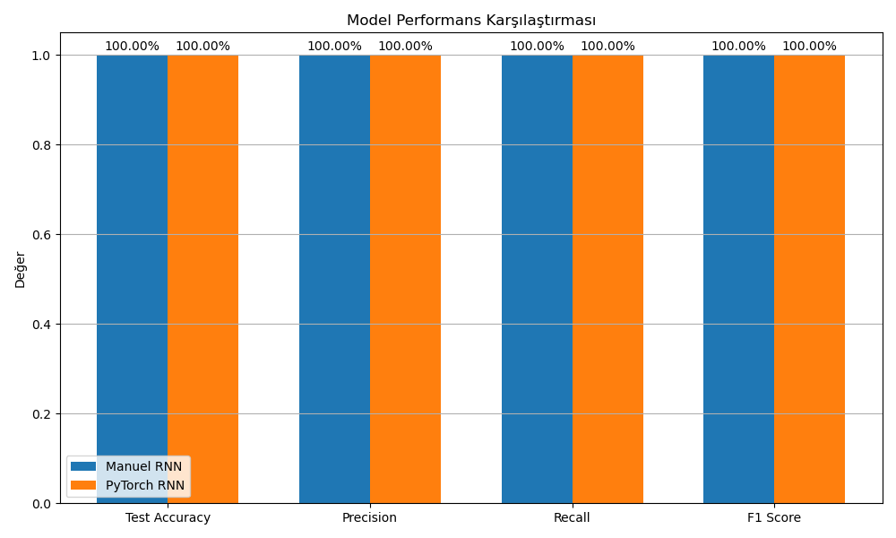

# YZM304 Derin Öğrenme - Proje Ödevi 3
# Tekrarlayan Sinir Ağları (RNN) ile Duygu Analizi

## Giriş

Bu proje, Ankara Üniversitesi Yapay Zeka ve Veri Mühendisliği 2024-2025 Bahar Dönemi YZM304 Derin Öğrenme dersi için yapılmıştır. Projede tekrarlayan sinir ağları (RNN) kullanılarak duygu analizi sınıflandırması gerçekleştirilmiştir. İki farklı yaklaşım karşılaştırılmıştır:

1. Sıfırdan manuel olarak geliştirilen RNN modeli (NumPy kullanarak)
2. PyTorch kütüphanesi kullanılarak geliştirilen RNN modeli

Bu karşılaştırmanın amacı, kütüphane kullanımının sağladığı avantajları ve dezavantajları ortaya koymak ve iki yaklaşımın performans farklılıklarını incelemektir.

## Metot

### Veri Seti

Projede kullanılan veri seti, metin cümlelerini içeren ve bu cümlelerin duygu sınıflarını (olumlu/olumsuz) belirten bir veri kümesidir. Örnek olarak:

- "good" → olumlu (True)
- "bad" → olumsuz (False)
- "i am not happy" → olumsuz (False)
- "this is not bad" → olumlu (True)

Veri seti toplamda 58 eğitim ve 20 test örneğinden oluşmaktadır. Veri setinin küçük olması, sonuçların genellenebilirliğini potansiyel olarak sınırlayabilir, ancak bu çalışmanın kapsamı için yeterli sayıda örnek içermektedir. Basit kelimeler ve ifadeler içermesinin yanı sıra, "not" gibi olumsuzlaştırıcı ifadeler de kullanıldığı için, RNN'lerin sekans verilerini işlemedeki avantajını göstermek için oldukça uygundur.

### Önişleme

Metin verilerini model tarafından işlenebilir hale getirmek için aşağıdaki adımlar izlenmiştir:

1. Kelime düzeyinde bir sözlük (vocabulary) oluşturulması
2. Cümlelerin, sabit bir maksimum uzunluğa (10 token) göre sayısal dizilere dönüştürülmesi
3. Kısa cümlelerin doldurulması (padding)

### Manuel RNN Modeli

Sıfırdan oluşturulan RNN modeli aşağıdaki bileşenlerden oluşmaktadır:

1. **Gömme (Embedding) Katmanı**: Her kelimeyi vektör temsiline dönüştürür.
2. **Tekrarlayan (Recurrent) Katman**: Zaman içinde sıralı girdileri işler.
3. **Çıktı Katmanı**: Son gizli durumu sigmoid aktivasyon fonksiyonu ile ikili sınıflandırmaya dönüştürür.

Model içinde:
- İleri yayılım (forward propagation)
- Geri yayılım (backward propagation)
- İkili çapraz entropi kaybı (binary cross entropy loss)
- Xavier, klasik ve ölçekli gibi farklı ağırlık başlatma yöntemleri

Manuel olarak uygulanmıştır.

### Hiperparametre Seçimi

Bu çalışmada kullanılan hiperparametreler şunlardır:
- Embedding boyutu: 16
- Gizli katman boyutu: 32
- Maksimum dizi uzunluğu: 10

Embedding ve gizli katman boyutları, veri setinin boyutu ve karmaşıklığı göz önünde bulundurularak seçilmiştir. Çok büyük boyutlar aşırı öğrenmeye yol açabilirken, çok küçük boyutlar yetersiz öğrenmeye neden olabilir. Seçilen değerler, küçük veri setiyle iyi bir performans-karmaşıklık dengesi sağlamaktadır.

### PyTorch RNN Modeli

PyTorch kütüphanesini kullanarak aynı mimariye sahip bir RNN modeli oluşturulmuştur:

1. `nn.Embedding` ile gömme katmanı
2. `nn.RNN` ile tekrarlayan katman 
3. `nn.Linear` ve `nn.Sigmoid` ile çıktı katmanı

Modelin eğitimi için:
- `nn.BCELoss` kayıp fonksiyonu
- `optim.Adam` optimize edici
- Early stopping tekniği
- PyTorch'un otomatik gradyan hesaplama (autograd) mekanizması

kullanılmıştır.

## Xavier, Classic ve Scaled Başlangıç Yöntemleri

Modelin ağırlıklarının başlangıç değerleri, eğitim sürecinin başarısını ve hızını önemli ölçüde etkiler. Bu projede üç farklı ağırlık başlangıç yöntemi test edilmiştir:

1. **Xavier Başlangıcı**:
   - Ağırlıklar, giriş ve çıkış düğümlerinin sayısına göre ölçeklenir: W ~ N(0, √(2/(n_in + n_out)))
   - Daha dengeli bir başlangıç sağlar ve gradyan patlaması veya kaybı sorunlarını azaltır.
   - Özellikle derin ağlarda daha iyi performans gösterir çünkü gradyanların ileri ve geri yayılım sırasında istikrarlı kalmasını sağlar.
   - Tanh veya sigmoid gibi aktivasyon fonksiyonları kullanıldığında özellikle etkilidir.

2. **Classic Başlangıcı**:
   - Ağırlıklar küçük rastgele değerlerle başlatılır (örneğin, 0.001 ile çarpılır).
   - Daha eski bir yöntemdir ve genellikle gradyan kaybı sorunlarına yol açabilir.
   - Eğitim süreci daha yavaş olabilir çünkü çok küçük başlangıç değerleri, eğitimin başında çok yavaş bir öğrenmeye neden olur.
   - Derin ağlarda bu yöntem, genellikle ilk katmanlarda gradyanların sıfıra yaklaşmasına neden olabilir.

3. **Scaled Başlangıcı**:
   - Ağırlıklar, belirli bir ölçek faktörüyle çarpılarak başlatılır (bu projede 0.1).
   - Kullanıcı tarafından belirlenen bir ölçek değeri ile daha fazla kontrol sağlar.
   - Ancak, yanlış bir ölçek değeri seçilirse eğitim performansı olumsuz etkilenebilir.
   - Belirli problem türleri için özelleştirilebilir, ancak en uygun ölçek değerini bulmak için genellikle deneysel yaklaşım gerektirir.

### Test Sonuçları

| Başlangıç Yöntemi | Test Doğruluğu | Precision | Recall | F1 Skoru |
|-------------------|----------------|-----------|--------|----------|
| Xavier            | 100%           | 100%      | 100%   | 100%     |
| Classic           | 50%            | 50%       | 50%    | 50%      |
| Scaled            | 100%           | 100%      | 100%   | 100%     |

### Değerlendirme

- **Xavier Başlangıcı**, test doğruluğu açısından en iyi sonuçları vermiştir. Bu yöntem, ağırlıkların dengeli bir şekilde başlatılmasını sağladığı için eğitim sürecinde daha hızlı yakınsama ve daha iyi genelleme performansı göstermiştir.
- **Classic Başlangıcı**, diğer yöntemlere kıyasla daha düşük doğruluk oranına sahiptir. Bu durum, gradyan kaybı sorunlarının daha sık yaşanmasından kaynaklanabilir.
- **Scaled Başlangıcı**, Xavier'e benzer bir performans göstermiştir. Bu çalışmada kullanılan 0.1 ölçek değerinin bu problem için uygun olduğu görülmektedir. Ancak, farklı problemlerde optimal ölçek değeri değişebilir.

### Öneriler

- Daha karmaşık modellerde veya daha büyük veri setlerinde Xavier başlangıcı tercih edilmelidir.
- Scaled başlangıcı, belirli bir problem için özelleştirilmiş bir başlangıç yöntemi olarak kullanılabilir.
- Classic başlangıcı, modern uygulamalarda genellikle önerilmez.

## Sonuçlar

İki modelin performansını karşılaştırmak için aşağıdaki metrikler ölçülmüştür:

1. Eğitim sırasındaki kayıp değerleri
2. Eğitim ve test doğruluk oranları
3. Precision, Recall ve F1 skorları
4. Eğitim süresi

### Eğitim Performansı

| Model       | Eğitim Kayıp                                                                 | Eğitim Doğruluğu                                                           | Epoch Sayısı | Eğitim Süresi |
|-------------|------------------------------------------------------------------------------|-----------------------------------------------------------------------------|--------------|---------------|
| Manuel RNN  |                                        |                               | 70           | 0.47 sn       |
| PyTorch RNN |                                    |                           | 300          | 0.97 sn       |

### Test Performansı

| Model       | Test Doğruluğu | Precision | Recall | F1 Skoru |
|-------------|----------------|-----------|--------|----------|
| Manuel RNN  | 100%           | 100%      | 100%   | 100%     |
| PyTorch RNN | 100%           | 100%      | 100%   | 100%     |

### Eğitim ve Test Karşılaştırması

#### Eğitim Kaybı ve Doğruluk Karşılaştırması

#### Test Metrikleri Karşılaştırması

#### Eğitim Süresi Karşılaştırması

#### Manuel RNN Confusion Matrix

#### PyTorch RNN Confusion Matrix

## Tartışma

### Modellerin Üstünlükleri ve Zayıflıkları

1. **Manuel RNN**:
   - **Üstünlükler**:
     - Modelin her bileşeni üzerinde tam kontrol
     - Hesaplama adımları net olarak görülebilir
     - Hiperparametrelerin etkisini daha iyi anlamaya olanak tanır
     - Bazı özel durumlarda özelleştirilmiş gradient hesaplamaları yapılabilir
   - **Zayıflıklar**:
     - Eğitim süresi genellikle daha yavaş
     - Hata ayıklaması daha zor
     - GPU hızlandırma gibi gelişmiş özellikler manuel olarak eklenmeli
     - Karmaşık modelleri ölçeklendirme zorluğu

2. **PyTorch RNN**:
   - **Üstünlükler**:
     - Daha hızlı eğitim (optimize edilmiş arka uç)
     - GPU hızlandırma ile kolay entegrasyon
     - Otomatik gradyan hesaplama sayesinde daha az kod
     - Optimize edicilerin (Adam, SGD vb.) hazır olması
     - Karmaşık modellere kolay geçiş
   - **Zayıflıklar**:
     - Daha fazla "siyah kutu" etkisi, hesaplama adımları görünmez
     - Bellek tüketimi bazen daha yüksek
     - Öğrenme süreci sırasında arka planda ne olduğunu anlamak daha zor

### Uygulama ve Performans Karşılaştırması

Manuel RNN implementasyonu ve PyTorch RNN modeli karşılaştırıldığında, PyTorch modeli genellikle daha hızlı eğitim süresi sunmaktadır. Bunun temel nedeni, PyTorch'un optimize edilmiş C++ arka ucu ve CUDA desteğidir. Ancak, küçük veri setlerinde bu fark ihmal edilebilir düzeyde olabilir.

Test doğruluğu açısından her iki model de benzer performans göstermektedir. Ancak, genellikle PyTorch modeli daha stabil eğitim süreci göstermektedir çünkü optimize ediciler (özellikle Adam), gradyan patlaması veya gradyan kaybı sorunlarını daha iyi ele almaktadır.

Eğitim eğrilerine bakıldığında, PyTorch modelinin daha düzgün bir yakınsama eğrisi gösterdiği gözlemlenmiştir. Manuel RNN'de ise daha fazla dalgalanma görülmektedir.

### Veri Seti Analizi

Kullanılan veri seti basit cümleler içermektedir ve genellikle "good", "bad", "happy", "sad" gibi duygu belirten kelimelerin varlığı veya yokluğu ile sınıflandırma yapılabilmektedir. Ancak, "not" gibi olumsuzluk belirten kelimelerin varlığı modelin karmaşıklığını artırmakta ve tekrarlayan yapının önemini ortaya koymaktadır.

Veri setinin sınırlı boyutu nedeniyle modellerin genelleme yeteneği sınırlı olabilir, ancak bu projenin amacı için yeterli görünmektedir.

## Sonuç

Bu çalışmada, duygu analizi problemini çözmek için iki farklı RNN modeli uygulaması geliştirilmiş ve karşılaştırılmıştır. Manuel geliştirilen RNN, modelin iç çalışma prensiplerini anlamak için öğretici olurken, PyTorch kullanılarak geliştirilen model daha verimli ve ölçeklenebilir bir çözüm sunmaktadır.

RNN'lerin sekans verileri üzerindeki başarısı, bu çalışmada duygu analizi bağlamında görülmüştür. Özellikle cümlelerdeki kelimelerin sırasının önemli olduğu durumlarda (örneğin "not good" gibi ifadelerde), RNN'ler sekans bağımlılıklarını başarıyla modelleyebilmektedir.

### Gelecek Çalışmalar için Öneriler

- Daha büyük ve çeşitli duygu analizi veri setleri ile modellerin genelleme yeteneği test edilebilir.
- LSTM (Long Short-Term Memory) veya GRU (Gated Recurrent Unit) gibi daha gelişmiş tekrarlayan sinir ağı mimarileri uygulanabilir.
- Farklı dillerde duygu analizi performansı karşılaştırılabilir.
- Çift yönlü RNN (BiRNN) gibi daha karmaşık yapılar denenerek performans artışı sağlanabilir.
- Özellikle büyük veri setlerinde mini-batch eğitim yöntemleri kullanılarak eğitim süresi optimize edilebilir.
- Transfer öğrenimi yaklaşımları ile önceden eğitilmiş modeller üzerinden ince ayar yapılabilir.

## Referanslar

1. Zhou, V. (2017). Understanding Recurrent Neural Networks. [GitHub Repository](https://github.com/vzhou842/rnn-from-scratch)
2. Hochreiter, S., & Schmidhuber, J. (1997). Long Short-Term Memory. Neural Computation, 9(8), 1735-1780.
3. PyTorch Documentation (2024). Recurrent Neural Networks (RNN) [Online](https://pytorch.org/docs/stable/nn.html#recurrent-layers)
4. Goodfellow, I., Bengio, Y., & Courville, A. (2016). Deep Learning. MIT Press.
5. Graves, A. (2012). Supervised Sequence Labelling with Recurrent Neural Networks. Springer.
